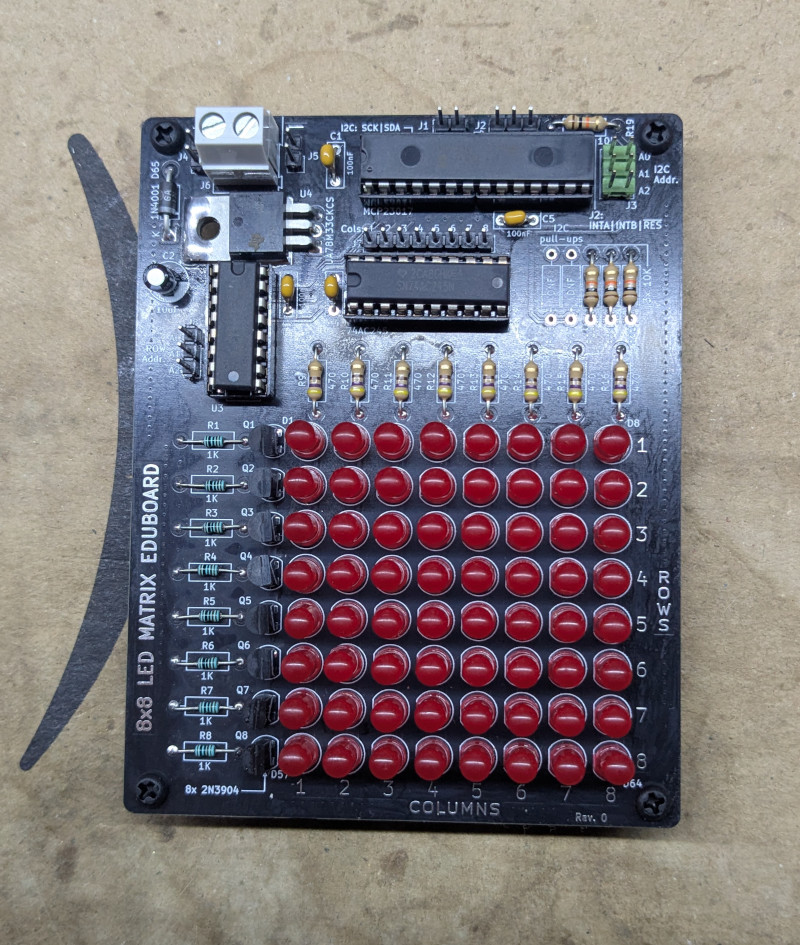
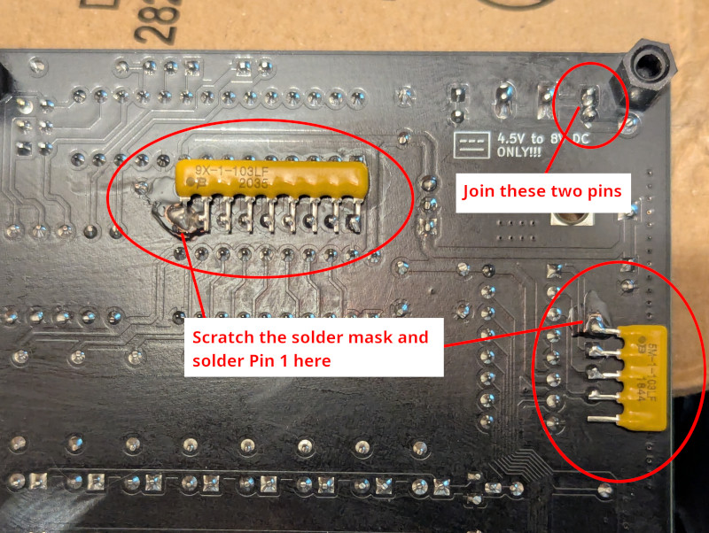

# 8x8 LED MATRIX EDUBOARD

## DISCLAIMER

Any use of this project is **under your own responsibility**.
You will be responsible of checking the correct construction and functionality of your board.
By using this project You will agree that I cannot be held responsible if it will destroy any of your devices, damage your computer, burn down your house or whatever.

## Introduction

This board is an educational implementation of an 8x8 multiplexed led matrix. The rows/columns bits can be either addressed via I2C through an MCP23017 or directly through the headers (after unplugging the MCP).

## Features

- Easy to solder through-hole design
- The board works at 3.3V and can be powered from a 4.5V to 8V DC source
- Controlled via i2c on a bog-standard MCP23017 port expander or directly via headers
- Optional onboard pullup resistors for I2C

## Theory of operation

This board is a simple circuit featuring a multiplexed 8x8 LED matrix.

Each column is connected through a resistor to an output of a 74AC244 octal buffer, the inputs of this buffer are controlled either by an MCP23017 port expander or directly by the pins at header J7.

The rows are controlled by a 74HC238 demultiplexer, whose outputs control the base of 8 NPN transistors, each one pulling all the cathodes of the leds on a single row to GND. The '238 demux has 3 inputs, 
piloted by either the MCP expander or directly via the J8 header. Toggling the 3 inputs composes a number in binary ranging from 0 to 7, this number will select which one of the rows will get enabled.
Only one can be active at a time, thus, the demux also acts as a protection avoiding eccessive power consumption if all the columns and leds get enabled together by mistake.

### Pin connections for the MCP23017

| Pin Name | Pin Number | Connection    |
| -------- | ---------- | ------------- |
| GPB0     | 1          | Column 1      |
| GPB1     | 2          | Column 2      |
| GPB2     | 3          | Column 3      |
| GPB3     | 4          | Column 4      |
| GPB4     | 5          | Column 5      |
| GPB5     | 6          | Column 6      |
| GPB6     | 7          | Column 7      |
| GPB7     | 8          | Column 8      |
| GPA5     | 26         | Row Address 2 |
| GPA6     | 27         | Row Address 1 |
| GPA7     | 28         | Row Address 0 |

Notice how the order of the row address lines is reversed in respect to pin numbering. This means that, for example, if you need to enable the fourth row (so row 3, as addressing begins at 0 and ends at 7),
one would need to compose the following binary combination on the pins GPA5-7: `110`, which is the reverse of `011`, or number 3 in decimal.

## Hardware

The board was designed with [KiCad](https://kicad.org/) EDA.

### Bill of Materials

| Component              | Qty | Type / Value                   | Notes                                                    |
| ---------------------- | --- | ------------------------------ | -------------------------------------------------------- |
| C1, C3, C4             |  3  | 100nF multilayer ceramic cap   | 5.0mm pitch                                              |
| C2                     |  1  | 10uF 16V+ electrolytic cap     | 2.5mm pitch                                              |
| D1 - D64               |  64 | Through hole led               | 5.0mm pitch                                              |
| J1, J2, J4, J5, J7, J8 |  1  | snappable 2.5mm pin header     | 20 pins are required for these headers                   |
| J3                     |  1  | snappable 2x3 2.5mm pin header | 6 pins in a 2x3 configuration are required               |
| J6                     |  1  | 1x2 Screw terminal             | 5.0mm pitch, Altech AK300-2 or similar                   |
| Q1 - Q8                |  8  | 2N3904 TO-92 transistors       |                                                          |
| R1 - R8                |  8  | 1K ohm resistors 1/4W          | 1% precision resistors are recommended                   |
| R9 - R16               |  8  | 470 ohm resistors 1/4W         |                                                          |
| R19 - R22              |  4  | 10K ohm resistors              |                                                          |
| R17, R18               |  2  | ~2.2K ohm resistors            | **optional**: install only if I2C pullups are required   |
| RN1                    |  1  | 8x10K ohm bussed resistor array| SIP9 package, bussed configuration                       |
| RN2                    |  1  | 4x10K ohm bussed resistor array| SIP5 package, bussed. a 3x10K SIP4 can be used, leaving last hole empty |
| U1                     |  1  | MCP23017                       | DIP 28 package                                           |
| U2                     |  1  | 74AC245                        | DIP 20 package                                           |
| U3                     |  1  | 74HC238                        | DIP 16 package                                           |
| U4                     |  1  | 78M33 voltage regulator        | TO-220 package                                           |

I strongly recommend to install sockets for all the ICs.

### Fixes

#### Rev. 0

- Rev.0 has a missing power trace. To fix this, join the two pins of header J4 on the underside of the board. A simple drop of solder is enough
- It is recommended to replace D65, the rectifier diode, with a schottky rectifier, like a 1N5818, for lower voltage drop
- Rev.0 lacks pulldown resistors on input pins of the '244 buffer and '238 demultiplexer. It is recommended to add them by soldering a bussed 10K resistor network on the underside of the board, on the solderpoints of headers J7 and J8, scratching the solder mask to access the ground plane for pin 1 of the arrays.

